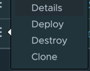

# Register Application


```shell
cp applications/processors/csv-json-processor/target/csv-json-processor-0.0.1-SNAPSHOT-metadata.jar /tmp
cp applications/processors/csv-json-processor/target/csv-json-processor-0.0.1-SNAPSHOT.jar /tmp
 ls /tmp/cs*
```

```shell
java -jar runtime/scdf/spring-cloud-dataflow-shell-2.11.5.jar
```

```shell
app register --bootVersion 3 --type processor --name csv-json-processor  --metadata-uri "file:///tmp/csv-json-processor-0.0.1-SNAPSHOT-metadata.jar" --uri "file:///tmp/csv-json-processor-0.0.1-SNAPSHOT.jar"
```


Create Stream with DSL

    Click Streams -> Create Streams(s)


Use Stream definition

```shell
csv-to-json=http --port=9002 | csv-json-processor --headers=firstName,lastName | log
```

Deploy Stream 



Using properties

```properties
app.http.server.port=9002
app.csv-json-processor.csv.to.json.headers=firstName,lastName
app.http.spring.cloud.stream.rabbit.binder.connection-name-prefix=http
app.log.spring.cloud.stream.rabbit.binder.connection-name-prefix=log
deployer.csv-json-processor.bootVersion=3
deployer.http.bootVersion=2
deployer.log.bootVersion=2
```

Test with CSV

```shell
curl -X POST http://localhost:9002  \
   -H 'Content-Type: text/csv' \
    -d '"Josiah","Imani"'
```
