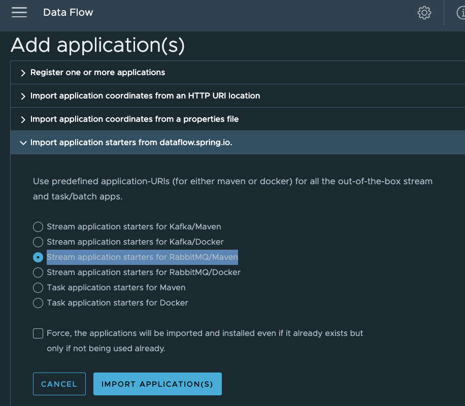

# Start RabbitMQ

Create the docker network (first time only)

```shell
docker network create tanzu
```


- Run RabbitMQ (user/bitnami)
```shell
docker run --name rabbitmq01  --network tanzu --rm -e RABBITMQ_MANAGEMENT_ALLOW_WEB_ACCESS=true -p 5672:5672 -p 5552:5552 -p 15672:15672  -p  1883:1883  bitnami/rabbitmq:4.0.4 
```

# Start Postgres


```shell
docker run --name postgresql --network tanzu  --rm  -e ALLOW_EMPTY_PASSWORD=true -p 5432:5432  bitnami/postgresql:latest
```


# Start SCDF


Download SCDF Jars (optional first time only)

```shell
mkdir -p runtime/scdf
wget  --directory-prefix=runtime/scdf https://repo.maven.apache.org/maven2/org/springframework/cloud/spring-cloud-dataflow-server/2.11.5/spring-cloud-dataflow-server-2.11.5.jar
wget --directory-prefix=runtime/scdf https://repo.maven.apache.org/maven2/org/springframework/cloud/spring-cloud-skipper-server/2.11.5/spring-cloud-skipper-server-2.11.5.jar
wget --directory-prefix=runtime/scdf https://repo.maven.apache.org/maven2/org/springframework/cloud/spring-cloud-dataflow-shell/2.11.5/spring-cloud-dataflow-shell-2.11.5.jar
```


Start Skipper
```shell
export ROOT_DIR=/Users/Projects/VMware/Tanzu/TanzuData/TanzuRabbitMQ/dev/tanzu-rabbitmq-event-streaming-showcase
java -jar runtime/scdf/spring-cloud-skipper-server-2.11.5.jar
```


Start Data Flow Server 
```shell
export ROOT_DIR=/Users/Projects/VMware/Tanzu/TanzuData/TanzuRabbitMQ/dev/tanzu-rabbitmq-event-streaming-showcase
export SPRING_APPLICATION_JSON='{"spring.cloud.stream.binders.rabbitBinder.environment.spring.rabbitmq.username":"user","spring.cloud.stream.binders.rabbitBinder.environment.spring.rabbitmq.password":"bitnami","spring.rabbitmq.username":"user","spring.rabbitmq.password":"bitnami","spring.cloud.dataflow.applicationProperties.stream.spring.rabbitmq.username" :"user","spring.cloud.dataflow.applicationProperties.stream.spring.rabbitmq.password" :"bitnami"}'

java -jar runtime/scdf/spring-cloud-dataflow-server-2.11.5.jar
```


Open Dashboard

```shell
open http://localhost:9393/dashboard
```


Import Application

    Click Applications -> Add Applications -> import application starters from dataflow.spring.io -> Stream application starters for RabbitMQ/Maven




