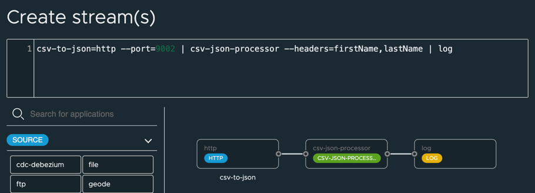
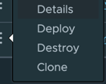

# LAB - CSV to JSON

The following will demonstrate using
a custom [CsvToJsonFunction.java](../../../../../applications/processors/csv-json-processor/src/main/java/showcase/scdf/csv/json/processor/function/CsvToJsonFunction.java)
processor to convert CSV to JSON.

## Register Application

Copy the jars to the /tmp directory
```shell
rm /tmp/csv-json-processor*.jar
cp applications/processors/csv-json-processor/target/csv-json-processor-0.0.1-SNAPSHOT-metadata.jar /tmp
cp applications/processors/csv-json-processor/target/csv-json-processor-0.0.1-SNAPSHOT.jar /tmp
ls /tmp/csv-json-processor*.jar
```

```shell
java -jar runtime/scdf/spring-cloud-dataflow-shell-2.11.5.jar
```

Start the SCDF Shell

```shell
app register --bootVersion 3 --type processor --name csv-json-processor  --metadata-uri "file:///tmp/csv-json-processor-0.0.1-SNAPSHOT-metadata.jar" --uri "file:///tmp/csv-json-processor-0.0.1-SNAPSHOT.jar"
```


## csv-to-json SCDF stream

Open SCDF Streams

```shell
open http://localhost:9393/dashboard/index.html#/streams/list
```

Create Stream with DSL


Use Stream definition

```shell
csv-to-json=http --port=9002 | csv-json-processor --headers=firstName,lastName | log
```



Click Create THE Stream(s) -> Create THE Stream(s)

Deploy Stream 



Click Free Text - > uses the following properties

```properties
app.http.server.port=9002
app.csv-json-processor.csv.to.json.headers=firstName,lastName
app.http.spring.cloud.stream.rabbit.binder.connection-name-prefix=http
app.log.spring.cloud.stream.rabbit.binder.connection-name-prefix=log
deployer.csv-json-processor.bootVersion=3
deployer.http.bootVersion=2
deployer.log.bootVersion=2
```

Test

```shell
curl -X POST http://localhost:9002  \
   -H 'Content-Type: text/csv' \
    -d '"Josiah","Imani"'
```
Open Stream in SCDF Dashboard

```shell
open http://localhost:9393/dashboard/index.html#/streams/list/csv-to-json
```


Click View Log of the "log" application


Scroll down and to right to see results