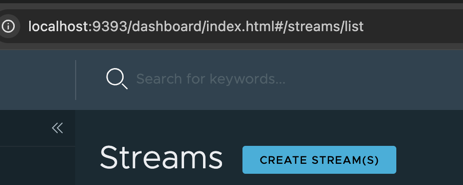
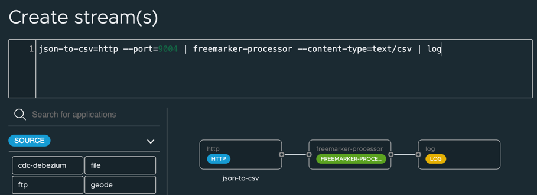
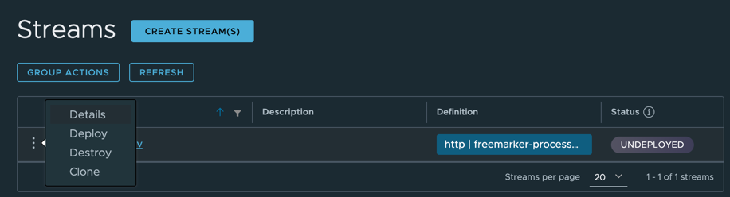
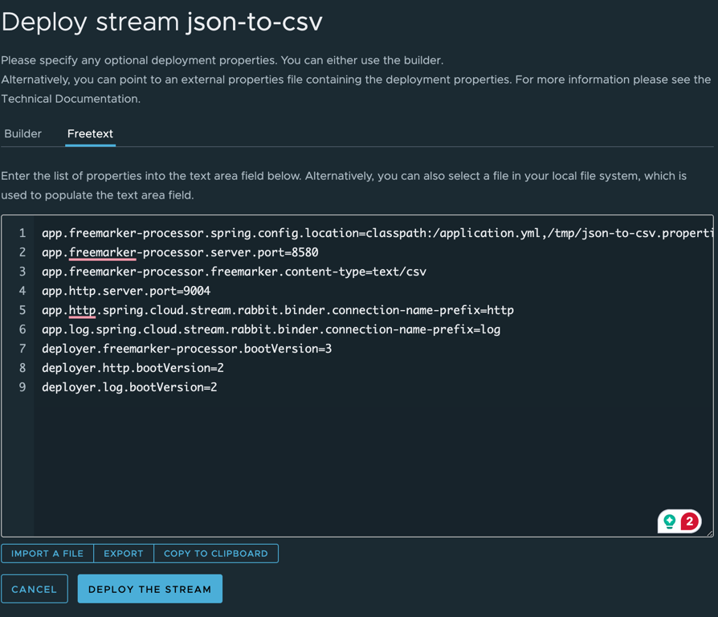
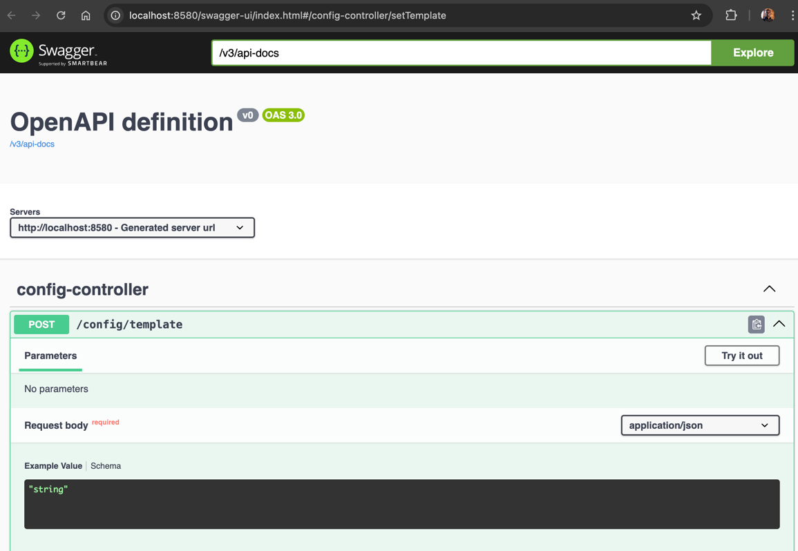
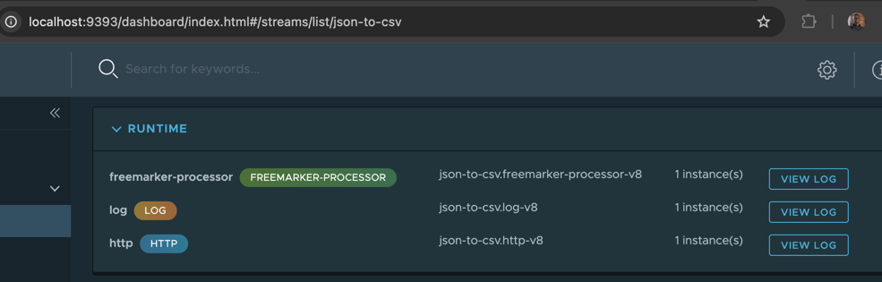
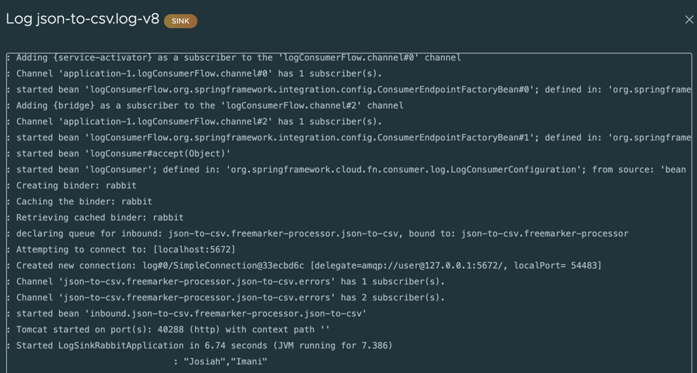

# LAB - JSON TO CSV

The following will demonstrate using
a custom [FreemarkerFunction.java](..%2F..%2F..%2F..%2F..%2Fapplications%2Fprocessors%2Ffreemarker-processor%2Fsrc%2Fmain%2Fjava%2Fshowcase%2Fscdf%2Ffreemarker%2Fprocessor%2Ffunction%2FFreemarkerFunction.java)
processor to convert JSON to CSV.

This reference implementation uses Apache FreeMarker™ is a template engine: a Java library to generate text output such as
HTML, CSV, XML and more.

See [Apache Freemarker](https://freemarker.apache.org/)
for details .


## Register Application

Copy the jars to the /tmp directory

```shell
rm /tmp/freemarker-processor*
cp applications/processors/freemarker-processor/target/freemarker-processor-0.0.1-SNAPSHOT.jar /tmp
cp applications/processors/freemarker-processor/target/freemarker-processor-0.0.1-SNAPSHOT-metadata.jar /tmp
ls /tmp/freemarker-processor*
```

Start the SCDF Shell

```shell
java -jar runtime/scdf/spring-cloud-dataflow-shell-2.11.5.jar
```

Execute the following to register the freemarker-processor.

```shell
app register --bootVersion 3 --type processor --name freemarker-processor  --metadata-uri "file:///tmp/freemarker-processor-0.0.1-SNAPSHOT-metadata.jar" --uri "file:///tmp/freemarker-processor-0.0.1-SNAPSHOT.jar"
```

## json-to-csv SCDF stream

Open SCDF Streams

```shell
open http://localhost:9393/dashboard/index.html#/streams/list
```

Create Stream with DSL



Use Stream definition

```shell
json-to-csv=http --port=9004 | freemarker-processor --content-type=text/csv | log
```

Click Create Stream -> Create Stream




Deploy Stream




Click Free Text




Use the following properties

```properties
app.freemarker-processor.spring.config.location=classpath:/application.yml,/tmp/json-to-csv.properties
app.freemarker-processor.server.port=8580
app.freemarker-processor.freemarker.content-type=text/csv
app.http.server.port=9004
app.http.spring.cloud.stream.rabbit.binder.connection-name-prefix=http
app.log.spring.cloud.stream.rabbit.binder.connection-name-prefix=log
deployer.freemarker-processor.bootVersion=3
deployer.http.bootVersion=2
deployer.log.bootVersion=2
```

Click DEPLOY THE STREAM

Once the stream is deployed Configure the FreeMarker Template

```shell
open http://localhost:8580/swagger-ui/index.html#/config-controller/setTemplate
```




Set String Temple


Click Try it out

Paste Freemarker Template

```csv
"${firstName}","${lastName}"
```
Click Execute

Testing

```shell
curl -X POST http://localhost:9004  \
   -H 'Content-Type: application/json' \
    -d '{ "firstName" : "Josiah", "lastName" : "Imani" }'
```

Open Stream

```shell
open http://localhost:9393/dashboard/index.html#/streams/list/json-to-csv
```

Click View Log of the "log" application



Scroll down and to right to see results




-------------------------------------------
## json-to-csv-file

The following will save the CSV to a file

Open Streams in the SCDF Dashboard

```shell
open http://localhost:9393/dashboard/index.html#/streams/list
```

Click CREATE STREAM

Use the following definition

```shell
json-to-csv-file=http --port=9005 | freemarker-processor --content-type=text/csv | file --directory=/tmp --name=csv-out.txt
```

Click CREATE STREAM(S)


Right Click Ellipse/dots next to "json-to-csv-file"

Click Deploy -> FreeText


Use the following properties

```properties
app.freemarker-processor.spring.config.location=classpath:/application.yml,/tmp/json-to-csv.properties
app.freemarker-processor.server.port=8581
app.freemarker-processor.freemarker.content-type=text/csv
app.file.directory=/tmp
app.file.name=csv-out.txt
deployer.file.bootVersion=2
app.http.server.port=9005
app.http.spring.cloud.stream.rabbit.binder.connection-name-prefix=http
app.log.spring.cloud.stream.rabbit.binder.connection-name-prefix=log
deployer.freemarker-processor.bootVersion=3
deployer.http.bootVersion=2
deployer.log.bootVersion=2
```


Click DEPLOY THE STREAM

Once the stream is deployed Configure the FreeMarker Template

```shell
open http://localhost:8581/swagger-ui/index.html#/config-controller/setTemplate
```

Paste Freemarker Template

```csv
"FILE-00A","${firstName}","${lastName}"
```
Click Execute


Testing

```shell
curl -X POST http://localhost:9005  \
   -H 'Content-Type: application/json' \
    -d '{ "firstName" : "Josiah", "lastName" : "Imani" }'
```


View Results in File

```shell
cat /tmp/csv-out.txt
```
