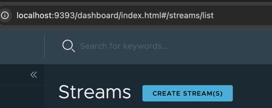

# LAB - JSON to XML

The following will demonstrate using
a custom [JsonToXmlProcessor.java](..%2F..%2F..%2F..%2F..%2Fapplications%2Fprocessors%2Fjson-xml-processor%2Fsrc%2Fmain%2Fjava%2Fshowcase%2Fscdf%2Fjson%2Fxml%2Fprocessor%2Ffunction%2FJsonToXmlProcessor.java)
processor to convert JSON to XML.


The application uses
[FasterXML/jackson](https://github.com/FasterXML/jackson) to convert 
JSON to XML.


## Register Application

Copy the jars to the /tmp directory

```shell
cp applications/processors/json-xml-processor/target/json-xml-processor-0.0.1-SNAPSHOT.jar /tmp
cp applications/processors/json-xml-processor/target/json-xml-processor-0.0.1-SNAPSHOT-metadata.jar /tmp
 ls /tmp/json-xml-processor*
```

Start the SCDF Shell

```shell
java -jar runtime/scdf/spring-cloud-dataflow-shell-2.11.5.jar
```

Start the SCDF Shell

```shell
app register --bootVersion 3 --type processor --name json-xml-processor  --metadata-uri "file:///tmp/json-xml-processor-0.0.1-SNAPSHOT-metadata.jar" --uri "file:///tmp/json-xml-processor-0.0.1-SNAPSHOT.jar"
```


## json-to-xml SCDF stream

Open SCDF Streams

```shell
open http://localhost:9393/dashboard/index.html#/streams/list
```

Create Stream with DSL



Use Stream definition

```shell
json-to-xml=http --port=9003 | json-xml-processor --root-name=users | log
```
Click Create THE Stream(s)


Right Click Ellipse/dots next to "json-to-xml"

Deploy Stream


Click Free Text - > uses the following properties

```properties
app.http.server.port=9003
app.json-xml-processor.json.to.xml.root-name=users
app.http.spring.cloud.stream.rabbit.binder.connection-name-prefix=http
app.log.spring.cloud.stream.rabbit.binder.connection-name-prefix=log
deployer.json-xml-processor.bootVersion=3
deployer.http.bootVersion=2
deployer.log.bootVersion=2
```

Testing 

```shell
curl -X POST http://localhost:9003  \
   -H 'Content-Type: application/json' \
    -d '{ "firstName" : "Josiah", "lastName" : "Imani" }'
```


Open Stream in SCDF Dashboard

```shell
open http://localhost:9393/dashboard/index.html#/streams/list/json-to-xml
```

Click View Log of the "log" application


Scroll down and to right to see results

