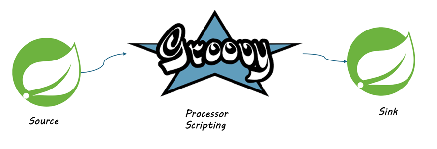

# LAB - Scripting Transformations with Groovy

This example will reformat dates 
using Spring Cloud Stream Application's [Groovy processor](https://docs.spring.io/stream-applications/docs/current/reference/html/#processors).



[Apache Groovy](https://groovy-lang.org/index.html) is a very powerful scripting language. 
It runs on top of the Java virtual machine. 

See differences between Groovy and Java
https://groovy-lang.org/differences.html


## Example Groovy Script

The [transform-dates.groovy](scripts/transform-dates.groovy) script contains 
an example of parsing JSON using Spring Boot's default Jackson JSON 
parsing libraries.

It expects the following example JSON payload,
where timestamp is a Unix Epoch Timestamp.


```json
{ "name" : "Josiah", "timestamp" : "1738152230" }
```


It will use java.text.SimpleDateFormat to format the date using the date format "M/dd/yyyy".


## Deploy Data Flow 


Copy Script to a tmp directory.
Note this is for easy access from the groovy processor application.


```shell
cp docs/workshops/Labs/Data-Transformation/labs/lab-enrichment-transformation/scripts/transform-dates.groovy /tmp
ls /tmp/transform-dates.groovy
```


Open the SCDF dashboard

```shell
open http://localhost:9393/dashboard/index.html#/streams/list
```

Create the stream using the following definition.

```shell
transform-dates=http --port=8085 | groovy --script=file:///tmp/transform-dates.groovy | log
```

Deploy stream in SCDF.


# Testing

Post the following payload to test the stream.

```shell
curl -X POST http://localhost:8085  \
   -H 'Content-Type: application/json' \
    -d '{ "name" : "Josiah", "timestamp" : "1738152230" }'
```


View logs of the log app

Example output

```shell
2025-01-29 07:47:07.787  INFO [log-sink,cd676e73c6176b17,490e2fad4075cfa3] 3073 
--- [ansform-dates-1] log-sink                                 
: {"name":"Josiah","timestamp":"1/20/1970"}
```
