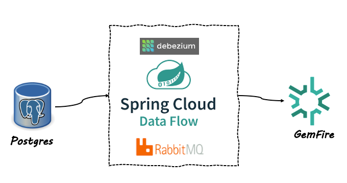
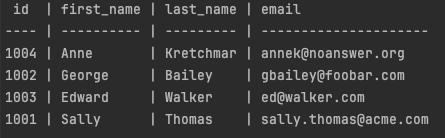
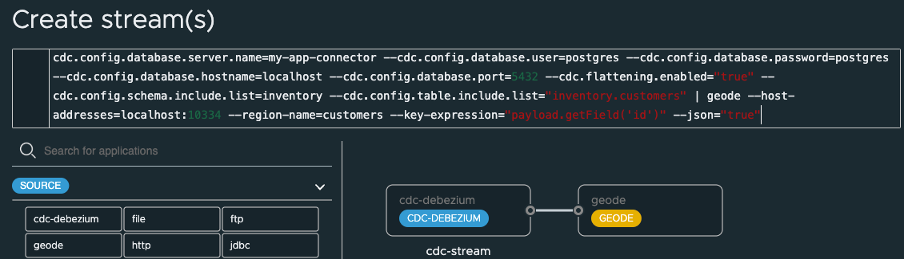
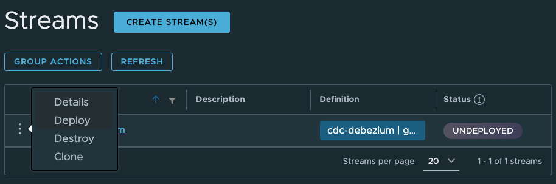
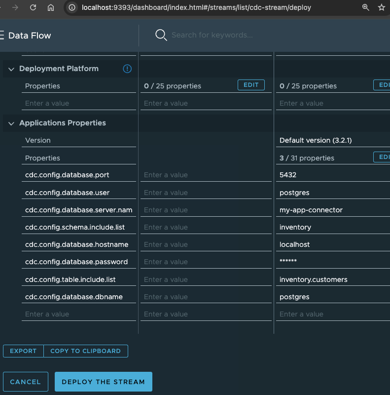

# Postgres CDC to GemFire

Spring Cloud Data Flow has a Change Data Capture (CDC) source based on [Debezium](https://debezium.io/documentation/reference/stable/connectors/index.html).

See the Spring documentation for other [CDC examples](https://spring.io/blog/2020/12/14/case-study-change-data-capture-cdc-analysis-with-cdc-debezium-source-and-analytics-sink-in-real-time)

This example will use the [Spring Cloud Stream Application Debezium CDC source](https://docs.spring.io/stream-applications/docs/current/reference/html/#spring-cloud-stream-modules-debezium-source) 
to capture database changes from PostgreSQL in real-time and send to [GemFire](http://gemfire.dev) using [RabbitMQ](http://rabbbitmq.com). 




This example will sync inventory customer changes in Postgres to VMware GemFire.




Note: In order to simplify the demo, this example uses the Geode Sink based on the open source Apache Geode.

Please see [Spring Cloud Data Flow for GemFire](https://docs.vmware.com/en/Spring-Cloud-Data-Flow-for-VMware-GemFire/1.0/scdf/index.html) for a production ready version of this demo. 

## Prerequisite

See [SCDF Getting-Started](00-SCDF-Getting-Started.md) for details on starting SCDF locally.

## Start Postgres

Run the following to Start Postgres in Docker.

```shell
docker run -it --rm --name postgres -p 5432:5432 -e POSTGRES_USER=postgres -e POSTGRES_PASSWORD=postgres debezium/example-postgres:2.3.3.Final
```

-------------------

## Start GemFire

Run the following to create a Docker network for the GemFire locator and server members to communicate.

```shell
docker network create gf-network
```

Run the following to Start a GemFire Locator in Docker.

```shell
docker run -it -e 'ACCEPT_TERMS=y' --rm --name gf-locator --network=gf-network -p 10334:10334 -p 1099:1099 -p 7070:7070 gemfire/gemfire:9.15.6 gfsh start locator --name=locator1 --jmx-manager-hostname-for-clients=127.0.0.1 --hostname-for-clients=127.0.0.1
```

Run the following to Start a GemFire Server in Docker.

```shell
docker run -it -e 'ACCEPT_TERMS=y' --rm --name gf-server1 --network=gf-network -p 40404:40404 gemfire/gemfire:9.15.6 gfsh start server --name=server1 --locators=gf-locator\[10334\] --hostname-for-clients=127.0.0.1
```

### Setup GemFire regions

The inventory custer data will be stored in a "customers" GemFire region.

Execute the following to start the GemFire Gfsh interactive shell on the locator

```shell
docker exec -it gf-locator gfsh
```

In Gfsh use the following command to connect to the locator

```shell
connect
```

In Gfsh use the following command to create the customers GemFire region

```shell
create region --name=customers --type=PARTITION
```

------------------

## Setup SCDF

Open [SCDF dashboard](http://localhost:9393/dashboard)

```shell
open http://localhost:9393/dashboard
```

[CREATE STREAMS](http://localhost:9393/dashboard/index.html#/streams/list)

With the following definition

```shell
cdc-stream=cdc-debezium --cdc.name=postgres-connector --cdc.config.database.dbname=postgres --connector=postgres --cdc.config.database.server.name=my-app-connector --cdc.config.database.user=postgres --cdc.config.database.password=postgres --cdc.config.database.hostname=localhost --cdc.config.database.port=5432 --cdc.flattening.enabled="true" --cdc.config.schema.include.list=inventory --cdc.config.table.include.list="inventory.customers" | geode --host-addresses=localhost:10334 --region-name=customers --key-expression="payload.getField('id')" --json="true"
```




Deploy





--------------
# Testing

Once the stream is deployed you can view the initial GemFire data using Gfsh.

In the Gfsh

```shell
docker exec -it gf-locator gfsh
```

Connect to the locator
```shell
connect
```

Select the customer data

```shell
query --query="select * from /customers"
```


## Insert new data in postgres

Connect to Postgres database using psql

```shell
docker exec -it postgres psql -d postgres -U postgres
```

Select current data

```shell
select * from inventory.customers;
```

Insert new data into inventory customers

```shell
insert into inventory.customers(id, first_name, last_name, email)
values(1005,'Josiah','Imani','jimani@example.email');
```


View Data in GemFire GFSH shell

```shell
query --query="select * from /customers"
```
