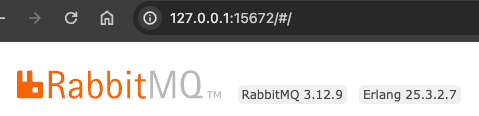

# Lab 3: Upgrade & Scaling RabbitMQ


**Prerequisite**
- Docker & Minikube
- [kubectl(https://kubernetes.io/docs/tasks/tools/)


# 1 - Create RabbitMQ Broker

```shell
kubectl apply -f deployment/cloud/k8/data-services/rabbitmq/rabbitmq-1-node.yml
```

Wait for broker to start
```shell
kubectl wait pod -l=app.kubernetes.io/name=rabbitmq --for=condition=Ready --timeout=160s
```

```shell
kubectl get services
```

Get Default User/Password

```shell
kubectl get secret rabbitmq-default-user -o jsonpath="{.data.username}"

export ruser=`kubectl get secret rabbitmq-default-user -o jsonpath="{.data.username}"| base64 --decode`
export rpwd=`kubectl get secret rabbitmq-default-user -o jsonpath="{.data.password}"| base64 --decode`

echo ""
echo "USER:" $ruser
echo "PASWORD:" $rpwd
```


Access DashLoad

Example (use above user/password)

```shell
open http://127.0.0.1:15672/
```

Review version

]

# 2 - Upgrade Version

```shell
kubectl apply -f deployment/cloud/k8/data-services/rabbitmq/upgrade/rabbitmq-1-node-3.12.13.yml
```


Wait for broker to start
```shell
kubectl wait pod -l=app.kubernetes.io/name=rabbitmq --for=condition=Ready --timeout=160s
```

Access DashLoad (use above user/password)

```shell
open http://127.0.0.1:15672/
```

View Version


# 3 - Scale to 3 Nodes


```shell
kubectl apply -f deployment/cloud/k8/data-services/rabbitmq/upgrade/rabbitmq-3-node-3.12.13.yml
```


Wait for broker to start
```shell
kubectl wait pod -l=statefulset.kubernetes.io/pod-name=rabbitmq-server-1 --for=condition=Ready --timeout=160s
```

```shell
kubectl wait pod -l=statefulset.kubernetes.io/pod-name=rabbitmq-server-2 --for=condition=Ready --timeout=160s
```

Access DashLoad (use above user/password)

```shell
open http://127.0.0.1:15672/
```


# 4 - Upgrade 3 Node Cluster

```shell
kubectl apply -f deployment/cloud/k8/data-services/rabbitmq/upgrade/rabbitmq-3-node-3.13.1.yml
```


Access DashLoad (use above user/password)

```shell
open http://127.0.0.1:15672/
```
